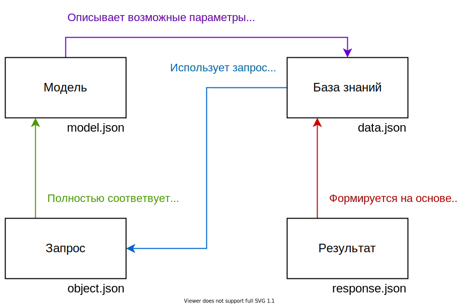

# Документация CucumberKB

- [Спецификация стандарта CUKB](SPECIFICATION.md)
- [Руководство пользователя системой](USERGUIDE.md)

[[_TOC_]]

## Архитектура системы

### Диаграмма связи подсистем

### Описание подсистем

| Название подсистемы (внутренний DNS) | Описание                                                                                                             |
| ------------------------------------ | -------------------------------------------------------------------------------------------------------------------- |
| `ui`                                 | Реализует пользовательский веб интерфейс и обращается напрямую к API. Единственная доступная подсистема из вне       |
| `api`                                | Занимается управлением хранения баз знаний, запросов, работает с базой данной и движком (формирует запросы к движку) |
| `kbsolver`                           | Движок базы знаний, написанный на Python, содержит огуречную суперсилу                                               |
| `db`                                 | База данных для хранения баз знаний, запросов, моделей                                                               |

## CUKB - Формат базы знаний

* Модель - описывает возможные входные параметры в решатель (наблюдаемые параметры)
* База знаний - определяет знания, структуру, поиск решения (система на основе графов)
* Запрос - экземпляр модели с заполненными параметрами, который отправляется в решатель, на его основе формируется результат
* Результат - сформулированное решение решателя на основе базы знаний и запроса

### Модель

В `schema` перечисляются все допустимые параметры, на основе них будет сформирован интерфейс для ввода запроса. Помимо этого, база знаний использует те же идентификаторы параметров в узлах решения, что описаны в модели.

Значения параметра `spec` зависит от `type` параметра (`bool`, `enum`, `float`).

* `bool` - используется для булевых переменных (вопрос с ответом "да" или "нет")
* `enum` - используется для перечислений с выбором одного варианта (например цвет: _красный_, _синий_, _зеленый_)
* `float` - численное значение с плавающей запятой, поддерживается возможность именования диапазонов (именованные диапазоны используются только в интерфейсе)

### База знаний

Раздел `stack` определяет возможные группы ответов (например _тип_, _класс_, _род_). Раздел `graph` определяет графовую систему решения.

В графе есть узлы двух типов:

- `condition` - узел решения, содержит перечисления условий, выполняет содержащийся в себе граф только при условии __истинного исполнения__ всех его условий.
- `report` - узел сохранения ответа, имеет дополнительный фильтр `requireScore` для блокировки ответа в случае слишком малого количества определенных параметров

> Стандарт определяет данные типы как базовые, могут быть добавлены дополнительные специальные узлы с собственной структурой описания.

#### Правила выполнения условий

1. Если параметр, используемый в условии, определен, условие считается истинным, если результат сравнения - истина
2. Если параметр, используемый в условии, __не__ определен, условие считается истинным, если поле `require` установлено в `false` (или поле `require` отсутствует)

#### Правила выполнения узла решения

1. Узел решения выполняет свой граф, если все его условия считаются истинной (т.е. для всех условий работает "AND").
2. `score` подсчитывается __только для условий, с определенным параметром__ (не зависит от того, считается ли условие истинным или нет).
3. В случае, если граф у узла выполняется - он выполняется __целиком__ и __последовательно__.
